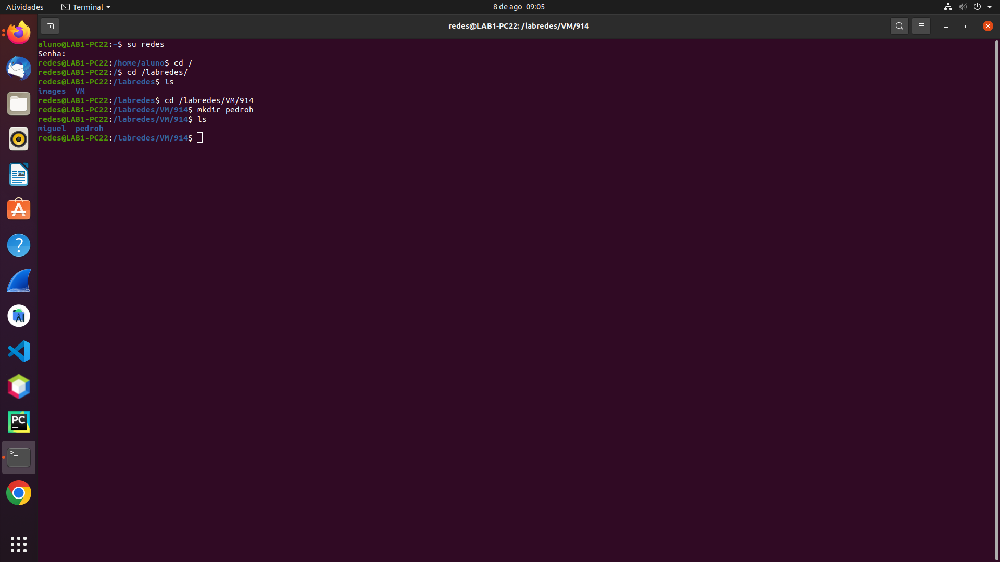
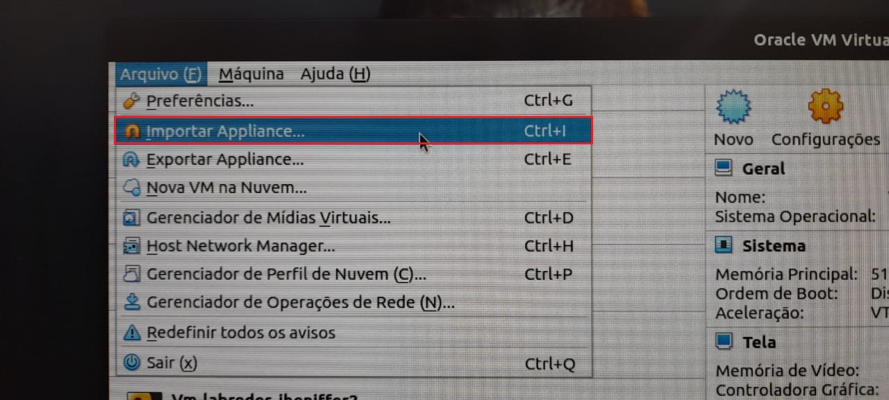
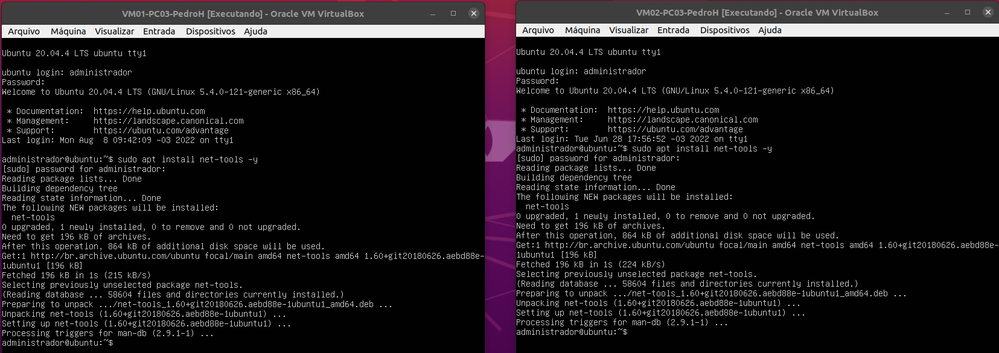
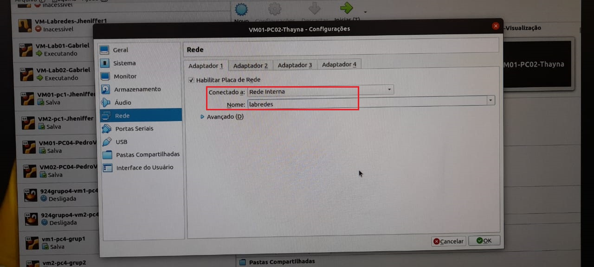
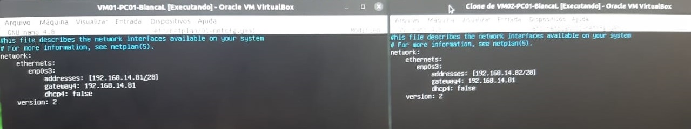
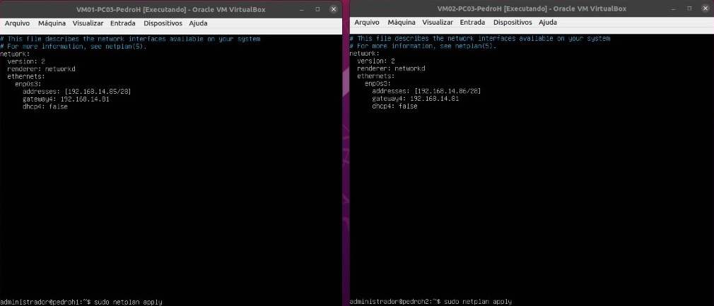
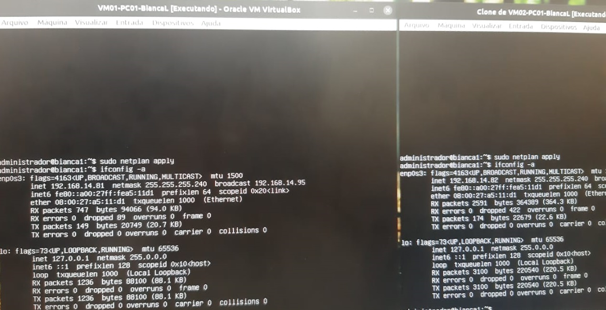

<h3>Etapa 1: Configuração do Ambiente Virtual</h3>

- **Passo 1:** Nesta etapa, o primeiro passo realizado consistiu em logar, no terminal de cada computador, utilizando-se o usuário redes ```su redes```, e, em seguida, houve a verificação da existência dos diretórios ```/labredes/images/original``` e ```/labredes/VM/914/<NomeDoAluno>```. Exemplo: foi necessário criar a pasta labredes e, dentro dela, a subpasta VM que contém o diretório 914 e, em seu interior, a pasta de nome “Thayná”. Isso foi realizado em todos os quatro computadores dos integrantes da equipe, a fim de manter o processo devidamente organizado. Em todos os casos, a imagem  (arquivo .OVA), necessária para a criação das máquinas virtuais, já estava instalada nos respectivos computadores, não sendo necessário realizar esse procedimento. Observação: as etapas seguintes foram realizadas duas vezes em cada computador dos integrantes, pois cada um deles deveria possuir duas VMs distintas.

<p>Figura 1: Exemplo da verificação do diretório destino.</p>


- **Passo 2:** Importar o arquivo .OVA.
<p>Figura 2: Importando Appliance contendo o arquivo .OVA.</p>


- **Passo 3:** Determinação dos diretórios destinos das máquinas virtuais (criados e verificados anteriormente, como já foi afirmado) e dos nomes das máquinas virtuais, neste caso:

<p>Tabela 1: Nome dos discentes e a nomenclatura das suas respectivas Máquinas Virtuais.</p>

|Discente|Máquinas Virtuais|
|--------|-----------------|
|Bianca Laiany|VM01-PC01-BiancaL<br>VM02-PC01-BiancaL|
|Pedro Henrique|VM01-PC03-PedroH<br>VM02-PC03-PedroH|
|Pedro Vinícius|VM01-PC04-PedroV<br>VM02-PC04-PedroV|
|Thayná Ingrid|VM01-PC02-Thayna<br>VM02-PC02-Thayna|

<p>Figura 3: Nomenclatura e destinação das Máquinas Virtuais.</p>


- **Passo 4:** Digitar no terminal de cada uma das oito VMs o seguinte comando para a instalação do net-tools:

```
sudo apt install net-tools -y
```

<p>Figura 4: Processo da instalação do net-tools.</p>


Para visualizar as configurações da Máquina Virtual, usa-se o comando ```ifconfig -a```.

- **Passo 5:** Configurar as redes de cada uma das VMs para que elas utilizem a mesma rede interna. Neste caso, selecionou-se ```Rede Interna``` e ```labredes``` como nomenclatura, assim como representa a imagem a seguir.

<p>Figura 5: Configuração de Rede da Máquina Virtual.</p>


- **Passo 6:** Execução das oito máquinas virtuais e realização do login com o usuário ```administrador``` e com a senha ```adminifal```.

<p>Figura 6: Login na Máquina Virtual.</p>


- **Passo 7:** Nesse passo, feita a configuração estática do endereço IP na interface de rede. Tal ação foi realizada a partir do comando ```$ sudo nano /etc/netplan/01-netcfg.yaml``` para a edição. Em seguida, levando-se em consideração a indentação das informações, determinou-se em cada uma das VMs o seu respectivo IP e o gateway (padronizados na tabela de Configurações), deixando, assim, o cliente DHCP desabilitado. As imagens a seguir mostram as configurações das oito máquinas.

<p>Figura 7: Configurações das Máquinas Virtuais da Bianca.</p>


<p>Figura 8: Configurações das Máquinas Virtuais do Pedro Henrique.</p>


<p>Figura 9: Configurações das Máquinas Virtuais do Pedro Vinícius.</p>


<p>Figura 10: Configurações das Máquinas Virtuais da Thayná.</p>


- **Passo 8:** O arquivo que estava sendo alterado ```/etc/netplan/01-netcfg.yaml``` foi salvo e as configurações foram aplicadas a partir do comando ```$ sudo netplan apply```. Ademais, para a verificação das modificações, utilizou-se ```$ ifconfig -a```, verificando, dessa forma, que o IP e o gateway foram corretamente determinados. 

<p>Figura 11: Exemplo de aplicação do comando da configuração de interface na VM01-PC01-BiancaL e VM02-PC01-BiancaL.</p>

