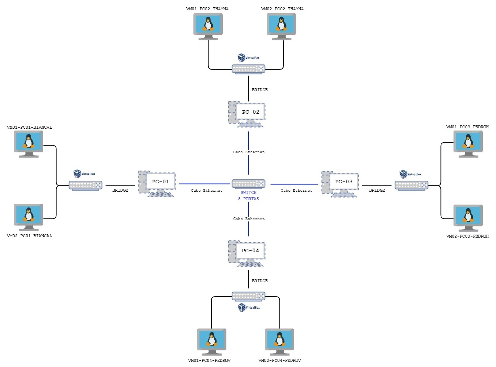
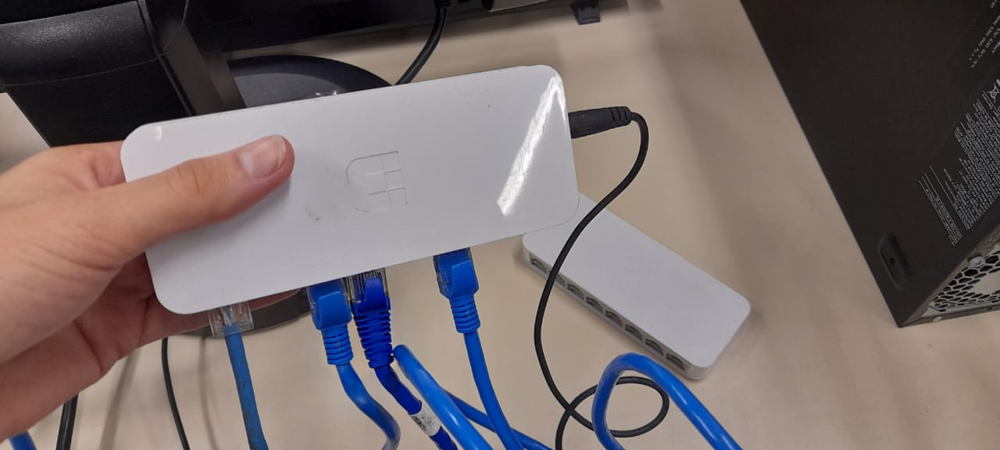
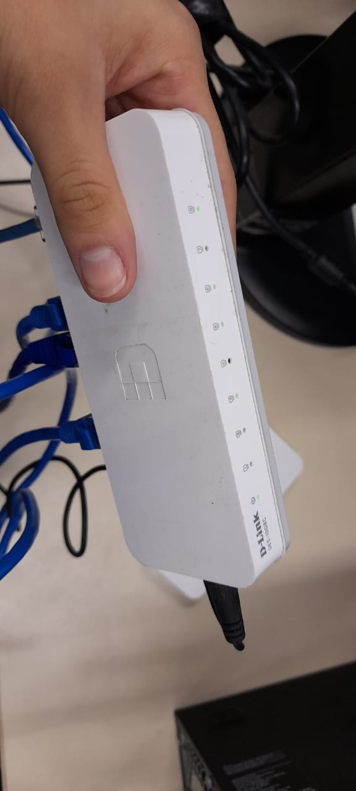
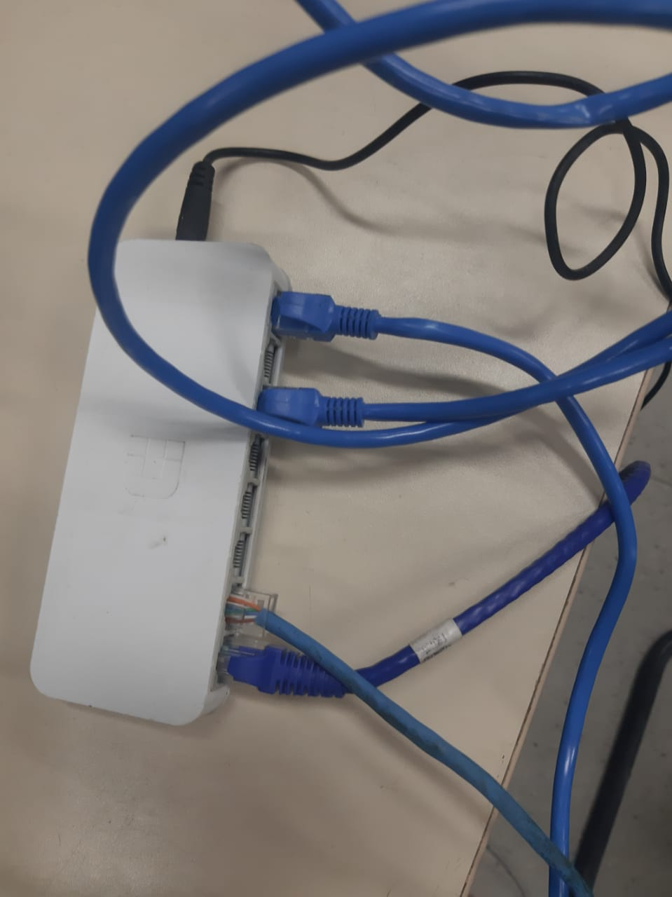
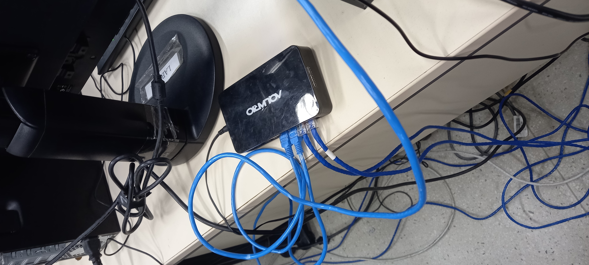
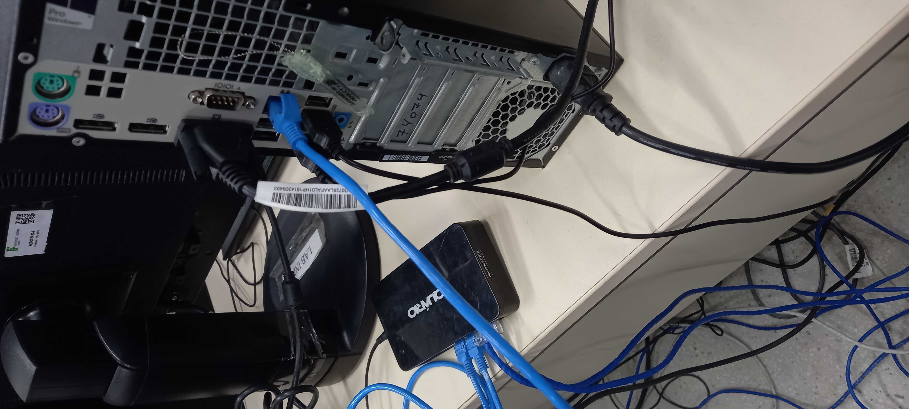
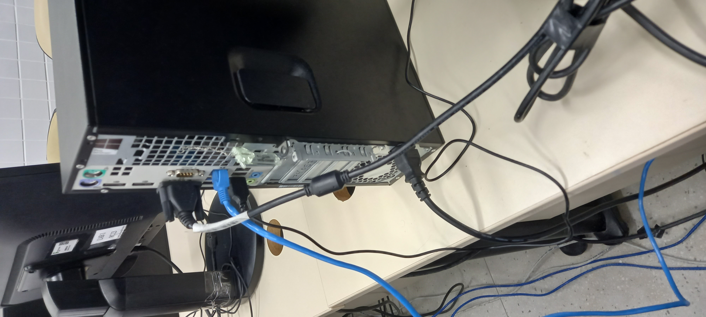
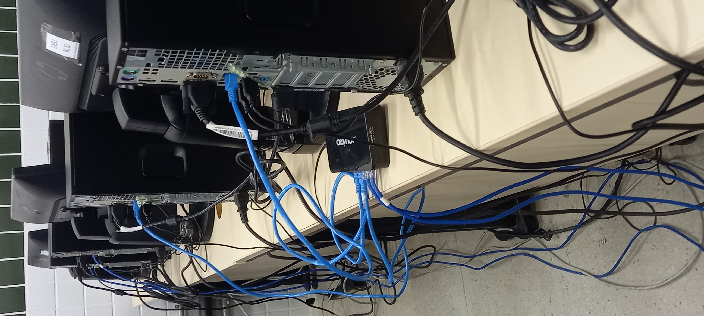

[Retornar para a Introdução :smile:](https://github.com/pedrohenriquee8/redes-grupo6-914)

# Visão Geral

<h2>Sumário</h2>

- [Conceitos](https://github.com/pedrohenriquee8/redes-grupo6-914/tree/main/projeto-2b-sred#conceitos)
- [Objetivo](https://github.com/pedrohenriquee8/redes-grupo6-914/tree/main/projeto-2b-sred#objetivo)
- [Roteiro](https://github.com/pedrohenriquee8/redes-grupo6-914/blob/main/projeto-2b-sred/Roteiro.md)

<h3>Conceitos</h3>

- Com base na representação da Topologia da Rede Virtualizada, presente na Figura 1, observa-se que é ela do tipo **Estrela**. Em síntese, nessa topologia, percebe-se a presença de um dispositivo central que interliga os componentes da rede mediante o uso de cabos. Nesse sentido, os dados são direcionados a um ponto central e, posteriormente, transmitidos aos outros itens da rede. Sob esse cenário, para o projeto em questão, o dispositivo central é um switch com 8 portas e, para a interligação dos elementos da rede, verifica-se o uso de cabos Ethernet.

<h3>Objetivo</h3>

- Em linhas gerais, o projeto tem como principal objetivo a criação de um ambiente de rede mediante o uso de máquinas virtuais (VirtualBox) com o Sistema Operacional Ubuntu Server. Nesse cenário, é de suma importância destacar que cada integrante ficou responsável pela criação de duas máquinas virtuais distintas, logo, totalizando oito máquinas virtuais para a equipe. Desse modo, o acesso remoto via SSH e comando ping tornam-se metas a serem cumpridas e permitirem a conclusão do projeto com êxito. Para isso, o uso de cabos Ethernet e de um switch para realizar a conexão entre as máquinas virtuais faz-se fundamental, como representa a imagem abaixo. Por fim, a fim de destacar as principais etapas adotadas na construção da infraestrutura e dos serviços da rede, observa-se o [Roteiro do Projeto](https://github.com/pedrohenriquee8/redes-grupo6-914/blob/main/projeto-2b-sred/Roteiro.md).

Figura 1: Topologia da Rede Virtualizada para o desenvolvimento do Projeto.

- Sob outra perspectiva, é de suma importância visualizar a Infraestrutura da Rede diante do aspecto Físico, ou seja, a Topologia Física. Assim sendo, segue as imagens que demonstram tal disposição da Rede.

Figura 2: Topologia Física da Rede - Primeira Apresentação do Switch.

Figura 3: Topologia Física da Rede - Segunda Apresentação do Switch.

Figura 4: Topologia Física da Rede - Terceira Apresentação do Switch.

Figura 5: Topologia Física da Rede - Quarta Apresentação do Switch.

Figura 6: Topologia Física da Rede - Primeira Apresentação da Conexão do cabo Ethernet ao PC.

Figura 7: Topologia Física da Rede - Segunda Apresentação da Conexão do cabo Ethernet ao PC.

Figura 8: Topologia Física da Rede - Visão Geral.

