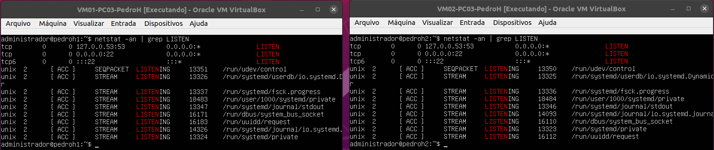

<h3>Etapa 3: Acesso Remoto via SSH</h3>

- Dando continuidade às práticas anteriores, o principal objetivo dessa etapa é configurar o acesso remoto via SSH nos servidores, sendo:

<p>Tabela 1: Nome dos discentes e a declaração dos seus respectivos servidores.</p>

|Discente|Servidores|
|--------|-----------------|
|Bianca Laiany|VM01-PC01-BiancaL<br>VM02-PC01-BiancaL|
|Pedro Henrique|VM01-PC03-PedroH<br>VM02-PC03-PedroH|
|Pedro Vinícius|VM01-PC04-PedroV<br>VM02-PC04-PedroV|
|Thayná Ingrid|VM01-PC02-Thayna<br>VM02-PC02-Thayna|

- **Passo 1:** Fazer o login nas Máquinas Virtuais, caso ainda não estejam logadas. 

Ubuntu Login: ```administrador``` <br>
Password: ```adminifal```

- **Passo 2:** Logo em seguida, é fundamental atribuir aos nomes servidores hostname. Nesse sentido, coloca-se o seguinte comando ```$ sudo hostnamectl set-hostname <hostname>``` em cada uma das VMs.

<p>Tabela 2: Declaração dos hostnames de cada integrante.</p>

|Discente|Descrição|Hostnames|
|-------|---------|---------|
|Bianca Laiany|VM01-PC01-BiancaL<br>VM02-PC01-BiancaL|bianca1<br>bianca2|
|Pedro Henrique|VM01-PC03-PedroH<br>VM02-PC03-PedroH|pedroh1<br>pedroh2|
|Pedro Vinícius|VM01-PC04-PedroV<br>VM02-PC04-PedroV|pedrov1<br>pedrov2|
|Thayná Ingrid|VM01-PC02-Thayna<br>VM02-PC02-Thayna|thayna1<br>thayna2|

Nesse sentido, foi preciso colocar os comandos com base nas respectivas máquinas, por exemplo: ```$ sudo hostnamectl set-hostname bianca01``` para a VM01-PC01-BiancaL.

<p>Figura 1: Atribuindo o nome do Hostname.</p>


- **Passo 3:** Instalar o servidor SSH. Para isso, antes de tudo, é essencial:

  - Modificar as configurações de cada VM e alterar novamente o Adaptador 1 para **NAT**;
  - Voltar para o terminal de cada VM e dar o comando ```$ sudo netplan apply``` para salvar as alterações;
  - Editar o arquivo ```01-netcfg.yaml``` com o seguinte comando ```sudo nano /etc/netplan/01-netcfg.yaml```;
  - Comentar as linhas de endereço IP estático e ativar o DHCP;
  - Digitar o comando ```sudo netplan apply``` para salvar as alterações;
  - Digitar o comando ```ifconfig -a``` para verificar se as modificações foram realizadas devidamente;
  - Certificar se a VM está acessando a internet, por meio dos seguintes comandos: ```$ sudo apt update``` (atualiza as definições e versões de pacotes/bibliotecas dos repositórios do ubuntu) e, posteriormente, ```$ sudo apt upgrade -y```.

Com isso, para realizar a instalação do SSH, torna-se necessário digitar o comando ```$ sudo apt-get install openssh-server``` e, por fim, para analisar se tudo ocorreu corretamente, usa-se o comando ```$ systemctl status ssh```.

- **Passo 4:** Verificar o status das portas do sistema. Para isso, é fundamental inserir ```netstat -an | grep LISTEN.``` Dessa forma, tal comando verifica se as conexões TCP na porta 22 estão como **LISTENING**.

<p>Figura 2: Verificação do status das portas do sistema.</p>


- **Passo 5:** Ativar o firewall. Isso deve ocorrer a fim de garantir o funcionamento correto do controle de acesso que se deve ter para configurar o firewall para conexão remota na porta via protocolo SSH 22. Por isso, deve digitar os seguintes comandos:

  - ```sudo ufw status``` - verifica o status do firewall;
  - ```sudo ufw allow ssh``` -  ativa o ssh no firewall UFW do ubuntu;
  - ```sudo ufw enable``` - ativa o firewall;
  - ```sudo ufw status``` - verifica o status do firewall.

<p>Figura 3: Verificação do status do Firewall.</p>


- **Passo 6:** Alterar as configurações de rede. Para isso, tem-se que realizar os seguintes passos:

  - Retornar para as configurações de interface de rede;
  - Modificar de **NAT** para **Modo Bridge** em cada VM;
  - Voltar para o terminal de cada VM e digitar o comando ```$ sudo netplan apply``` para salvar as alterações;
  - Editar o arquivo ```01-netcfg.yaml``` com o seguinte comando ```$ sudo nano /etc/netplan/01-netcfg.yaml```;
  - Retirar os comentários  das linhas de endereço IP estático e desativar o DHCP;
  - Digitar o comando ```$ sudo netplan apply``` para salvar as alterações;
  - Digitar o comando ```ifconfig -a``` para verificar se as modificações foram realizadas. 

- **Passo 7:** Acessar a Máquina Virtual via SSH. Para isso, tem-se que colocar o comando ```$ ssh <user>@<ipServidorRemoto>```, por exemplo:

<p>Tabela 3: Declaração das configurações a serem usadas via SSH.</p>

|Endereços IP|Descrição|Hostnames|
|-------|---------|---------|
|192.168.14.81<br>192.168.14.82|VM01-PC01-BiancaL<br>VM02-PC01-BiancaL|bianca1<br>bianca2|
|192.168.14.83<br>192.168.14.84|VVM01-PC02-Thayna<br>VM02-PC02-Thayna|thayna1<br>thayna2|

<h3>Aplicação: </h3>
 
 <p>Tabela 4: Orientação acerca da conexão a ser feita via SSH.</p>
 
|Orientação|
|----------|
|De: VM01-PC01-Thayna|
|Para: VM02-PC01-BiancaL|

Nesse cenário, antes de tudo, para efetuar tal atividade, a verificação da configuração de rede das Máquinas Virtuais faz-se necessária, tendo em vista que precisam estar em **Modo Bridge**, outrossim, conectadas via cabos Ethernet. Assim sendo, basta inserir, no terminal do servidor VM01-PC01-Thayna, o comando ```$ ssh administrador@192.168.14.82``` para realizar a conexão com êxito. 

<p>Figura 4: Exemplo do uso do SSH.</p>

