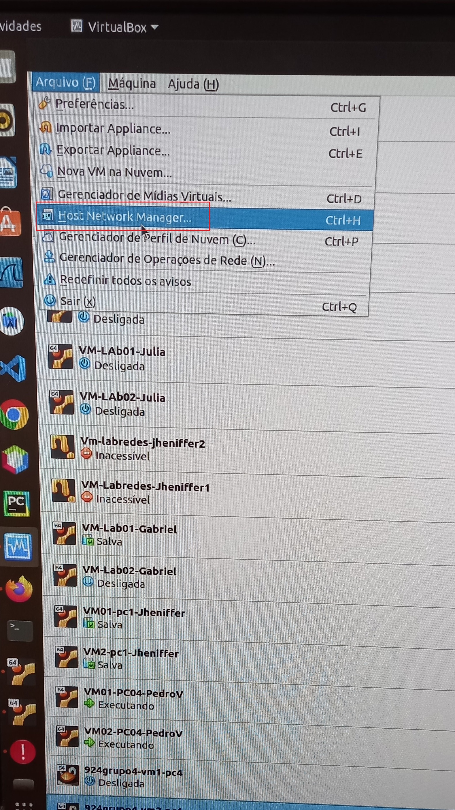

[Retornar para a Visão Geral. :smile:](https://github.com/pedrohenriquee8/redes-grupo6-914/tree/main/projeto-2b-sred) <br>
[Retornar para o Roteiro. :grin:](https://github.com/pedrohenriquee8/redes-grupo6-914/blob/main/projeto-2b-sred/Roteiro.md)

<h3>Etapa 4: Acesso Remoto via SSH com HostOnly</h3>

- Na etapa 4, a princípio, devemos configurar o acesso remoto a todas as máquinas virtuais cadastradas, através do terminal do PC, por meio do SSH (Secure Socket Shell), que é um protocolo específico de segurança de troca de arquivos entre cliente e servidor utilizando a porta 22, sendo a única que precisa ficar aberta no firewall do servidor.

- **Passo 1:** Fazer o login nas Máquinas Virtuais, caso ainda não estejam logadas.

Ubuntu Login: `administrador` <br>
Password: `adminifal`

- **Passo 2:** Ativar a interface do computador para viabilizar o contato entre a VM e Host, que no caso é o PC.

  - No campo `Arquivo` na configuração da VM, deve-se acessar a opção `Host Network Manager`;
  - Inserir manualmente os campos do Adaptador de acordo com a imagem abaixo:

<p>Figura 1: Acessando a opção Host Network Manager.</p>


<p>Figura 2: Verificando as configurações do Adaptador.</p>

  
  - Configurar o ```Servidor DHCP``` no adaptador VBoxNet0, devendo estar de acordo com a imagem abaixo:

<p>Figura 3: Verificando as configurações dos endereços na aba Servidor DHCP.</p>


- **Passo 3:** Adicionar um adaptador ao HostOnly em uma VM.

  - Antes de iniciar, é de extrema importância dar acesso a uma VM via rede pelo Terminal do PC, sendo adicionado um novo Adaptador de rede à VM;
  - Acessar as configurações de Rede da VM desejada;
  - No Adaptador 2, deve-se habilitar a opção `Habilitar Placa de Rede` e selecionar no campo `Conectado a`: `Placa de rede exclusiva de hospedeiro (host-only)`, declarando o campo `Nome` como `vboxnet0`.

<p>Figura 4: Conexão ao HostOnly.</p>


- **Passo 4:** Ativar as configurações da interface na VM para o servidor DHCP.

  - Verificar a existência da interface `enp0s8` mediante o comando `$ ifconfig -a`;
  - Feita a verificação, torna-se necessário acessar a configuração das interfaces no netplan. Assim sendo, deve-se digitar o comando `$ sudo nano /etc/netplan/01-netcfg.yaml` e ativar o DHCP para o Adaptador 2 (enp0s8), como demonstra a imagem abaixo:

<p>Figura 5: Acessando as configurações do netplan e ativando o DHCP para o Adaptador 2.</p>


- Com isso, aplicam-se as alterações feitas mediante o uso do comando `$ sudo netplan apply`;
- Para verificar se a aplicação foi, de fato, implementada, utiliza-se o comando `$ ifconfig -a`, como exibe a imagem abaixo:

<p>Figura 6: Verificando as configurações de interface do netplan.</p>

