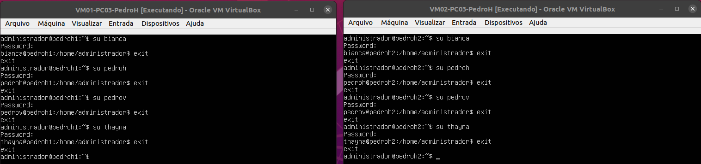

[Retornar para a Visão Geral. :smile:](https://github.com/pedrohenriquee8/redes-grupo6-914/tree/main/projeto-2b-sred)  
[Retornar para o Roteiro. :grin:](https://github.com/pedrohenriquee8/redes-grupo6-914/blob/main/projeto-2b-sred/Roteiro.md)

<h3>Etapa 5: Serviço de Nomes Estático</h3>

- Na última etapa do projeto, observa-se a configuração dos nomes de host estático, sendo definidos localmente no diretório `/etc/hosts`. Nesse sentido, para ter acesso aos recursos de host, o comando `$ sudo nano /etc/hosts` torna-se fundamental.

- **Passo 1:** Digitar o comando `$ sudo nano /etc/hosts` no terminal da máquina.

- **Passo 2:** Ao acessar o diretório, cada integrante deve, em suas respectivas Máquinas Virtuais, digitar o endereço IP, o hostname, o domínio e o apelido de cada membro, tendo em vista a [Tabela de Configurações de cada Integrante](https://github.com/pedrohenriquee8/redes-grupo6-914/blob/main/projeto-2b-sred/Configuracoes.md#tabela-1-configurações-das-máquinas-virtuais-de-cada-integrante), obtendo como resultado a seguinte imagem:

Figura 1: Acessando as configurações dos nomes de host estático.

- **Passo 3:** Cada membro deve inserir, em cada Máquina Virtual, os usuários de todos os integrantes da equipe, possibilitando o uso do comando `$ ssh <user>@<hostname|fqdn|alias>`. Para isso, basta utilizar o comando `$ sudo adduser <NomeDoIntegrante>` e adicionar as informações de cada membro.

- **Passo 4:** Digitar o comando `sudo cat /etc/passwd` a fim de verificar os usuários criados.

Figura 2: Verificação da criação dos usuários.

Figura 3: Acessando os usuários criados na Máquina Virtual.

- **Passo 5:** Para concluir o projeto com êxito, faz-se necessário utilizar o `comando ssh` e acessar todas as Máquinas Virtuais, cada uma com a configuração de rede no modo Bridge, mediante o uso de cabos Ethernet conectados a um switch. Nesse sentido, tais passos podem ser verificados no próximo tópico: Aplicação.

<h3>Aplicação: </h3>

- A primeira aplicação consiste no acesso via SSH ao endereço IP da VM02-PC02-Thayna logado no usuário pedroh. Desse modo, com o auxílio da imagem abaixo, verifica-se que tal processo foi efetuado pela Máquina Virtual VM01-PC01-BiancaL.

Figura 4: Acessando a Máquina Virtual VM02-PC02-Thayna via endereço IP.

- A segunda aplicação compreende o acesso via SSH ao hostname da VM01-PC01-BiancaL logado no usuário thayna. Desse modo, com o auxílio da imagem abaixo, verifica-se que tal processo foi efetuado pela Máquina Virtual VM01-PC03-PedroH.

Figura 5: Acessando a Máquina Virtual VM01-PC01-BiancaL via hostname.

- A terceira aplicação corresponde ao acesso via SSH ao domínio (FQDN) da VM02-PC01-BiancaL logado no usuário thayna. Desse modo, com o auxílio da imagem abaixo, verifica-se que tal processo foi efetuado pela Máquina Virtual VM01-PC04-PedroV.

Figura 6: Acessando a Máquina Virtual VM02-PC01-BiancaL via domínio (FQDN).

- A quarta aplicação abrange o acesso via SSH ao aliase da VM01-PC01-BiancaL logado no usuário pedrov. Desse modo, com o auxílio da imagem abaixo, verifica-se que tal processo foi efetuado pela Máquina Virtual VM01-PC02-Thayna.

Figura 7: Acessando a Máquina Virtual VM01-PC01-BiancaL via aliase.

